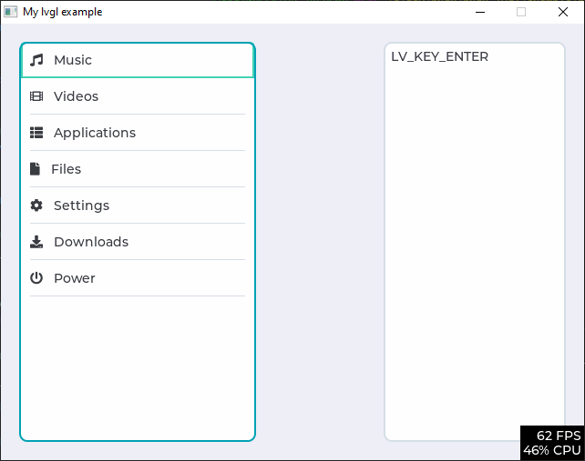
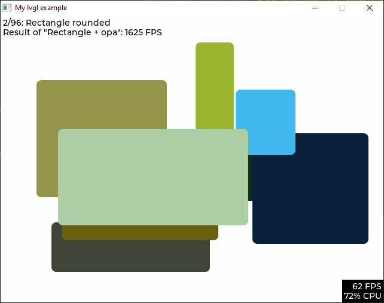
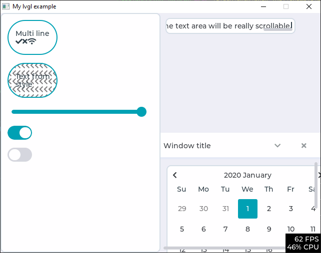

# lvgl-sdl
  

A crossplatform SDL wrapper for the Light and Versatile Graphics Library https://lvgl.io/.
* SDL2 video backend.
* SDL gamecontroller and keyboard input driver.
* Filesystem driver uses `stdio.h` for file access.
* Supports directory listings with `windows.h` winapi for Windows, and `dirent.h` for Linux.
* Cross platform. Currently supports Windows, Linux and Original Xbox!

# Include in your project
In your git repo:
* `git submodule add https://github.com/Ryzee119/lvgl-sdl.git`
* See the example [CMakeLists.txt](./example/CMakeLists.txt) for the required directories to include in your build system.
* Copy `lv_conf.h` from `example/` folder *next* to the lvgl-sdl directory in your project.
* See the [example](./example/example.c) for usage and required initialisation functions etc.

# Build the examples
* Pre-built binaries can be downloaded from the [Actions](https://github.com/Ryzee119/lvgl-sdl/actions) page as artifacts. These just run the default example.
* For manual compiling you can edit `lv_ex_conf.h` to change which demo to run.

## Build (Linux)
```
apt install libsdl2-dev
cd example/
mkdir build
cd build
cmake ..
make
./lvgl_example
```

## Build (Windows)
From a [MYSYS2](https://www.msys2.org/) environment:
```
pacman -S mingw-w64-x86_64-make \
          mingw-w64-x86_64-cmake \
          mingw-w64-x86_64-gcc \
          mingw-w64-x86_64-SDL2
cd example/
mkdir build
cd build
cmake ..
make
./lvgl_example.exe
```

## Build (Original Xbox)
Setup and install [nxdk](https://github.com/XboxDev/nxdk/)
```
cd example/
make -f Makefile.nxdk NXDK_DIR=/path/to/nxdk
```
If you get a [llvm error](https://github.com/XboxDev/nxdk/issues/196), try adding llvm to `PATH` i.e: `export PATH=$PATH:/usr/lib/llvm-6.0/bin`

## Images





